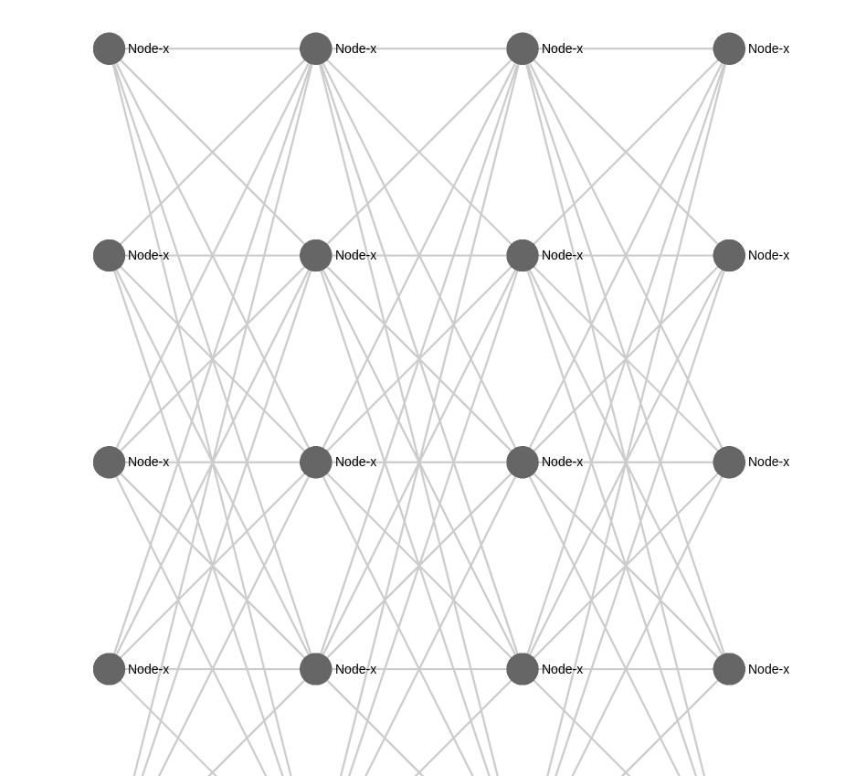

S5NN.js - v1.0.0
=================





S5NN is a Javascript library dedicated to neural graph drawing based on Sigma.js , mainly developed by [@loaiabdalslam](https://github.com/loaiabdalslam/) .

Sigma is a JavaScript library dedicated to graph drawing, mainly developed by [@jacomyal](https://github.com/jacomyal) and [@Yomguithereal](https://github.com/Yomguithereal).

### Resources

[The website](http://sigmajs.org) provides a global overview of the project, and the documentation is available in the [GitHub Wiki](https://github.com/jacomyal/sigma.js/wiki).

Also, the `plugins` and `examples` directories contain various use-cases that might help you understand how to use sigma.

### How to use it

To use it, clone the repository:

```

git clone git@github.com:loaiabdalslam/S5NN.js.git
```

To build the code:

 - Install [Node.js](http://nodejs.org/).
 - Install [gjslint](https://developers.google.com/closure/utilities/docs/linter_howto?hl=en).
 - Use `npm install` to install sigma development dependencies.
 - Use `npm run build` to minify the code with [Uglify](https://github.com/mishoo/UglifyJS). The minified file `sigma.min.js` will then be accessible in the `build/` folder.
 - open examples path and enjoying with neural's graphs Versions .  

Also, you can customize the build by adding or removing files from the `coreJsFiles` array in `Gruntfile.js` before applying the grunt task.


### Features 


### Visualization : 

#### Graphs :
  - 2D
  - 3D (Soon) 
#### Layers :
  - Fully Connected Layers
  - RNN (Soon)
#### Networks :
  - MLP
  - LSTM (Soon)
  - CNN (Soon)

### Integration :
  - brain.js (Soon)
  - Tensorflow.js (Soon) 


### Contributing

You can contribute by submitting [issues tickets](http://github.com/jacomyal/sigma.js/issues) and proposing [pull requests](https://github.com/loaiabdalslam/S5NN.js/pulls). Make sure that tests and linting pass before submitting any pull request by running the command `grunt`.

The whole source code is validated by the [Google Closure Linter](https://developers.google.com/closure/utilities/) and [JSHint](http://www.jshint.com/), and the comments are written in [JSDoc](http://en.wikipedia.org/wiki/JSDoc) (tags description is available [here](https://developers.google.com/closure/compiler/docs/js-for-compiler)).
